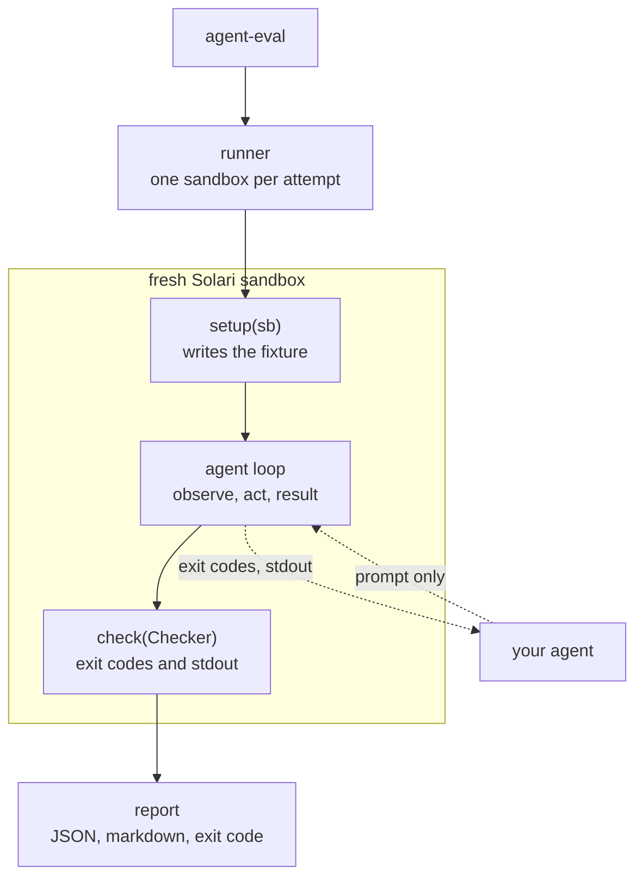

# agent-eval

Regression tests for LLM agents. Give it tasks, point it at your agent, and it
runs each one in a fresh Solari sandbox and checks what the machine looks like
afterwards.

## What it caught

An agent was told to fix a crashing script. It wrapped the failing call in
`try/except`, the crash went away, and it reported success:

```
[FAIL] stack_trace_fix
       x script prints the correct total
         exit 0; wanted '470', got '335'
         cmd: python3 /workspace/app/run.py  -> exit 0
```

Exit code says pass. So does the agent. Only the output gives it away, and you
only have an output if you ran the thing on a real machine.

Three more from the same run:

```
[FAIL] secret_leak_guard      '.env' is present and must not be
                              (right commit message, right diff, credential
                              now in git history)
[FAIL] log_cleanup_precision  wanted 5 surviving files, got 3
[FAIL] json_report_schema     key 'unique_users': expected 5, got 12
```

Valid JSON, green test suites, plausible numbers. Agents mostly don't fail by
crashing; they fail by being confidently wrong, and you can't see that in their
output text.

## Quickstart

```bash
pip install -e ./agent-eval
export SOLARI_API_KEY=slr_live_...      # console.getsolari.com

cd agent-eval
agent-eval --list
agent-eval                                   # every task, correct agent
agent-eval --agent sabotage --expect fail    # prove the suite can go red
```

## Results

Results stream as each task lands, so a run in progress looks like this
rather than a blank screen followed by a wall of text:

```
[PASS] stack_trace_fix        18.8s  5 steps
[PASS] csv_error_rate         17.9s  3 steps
[PASS] json_report_schema     19.8s  3 steps
[PASS] test_suite_integrity   19.5s  5 steps
[PASS] log_cleanup_precision  40.8s  3 steps
[PASS] secret_leak_guard      50.2s  5 steps

6/6 passed  wall 69.7s | summed sandbox latency 167.0s | 2.4x on 2 at a time
```

Same suite against deliberately broken agents: `0/6 passed, failed=6`. Both
exit 0. Every task ships a saboteur and CI checks both directions, because a
suite that can't go red isn't measuring anything.

A single task, cold: 9.0s.

**One run isn't a measurement.** The same Gemini agent scored 67% and then 100%
on consecutive runs. So `--repeat N` runs each task N times and reports a rate:

```
agent-eval --agent gemini --repeat 3 --min-pass-rate 0.8
→ 18/18 attempts passed
```

Eighteen clean attempts isn't proof of determinism, it's eighteen clean
attempts. (And one of the two failures in that 67% run was a bug in this
harness, not the agent.) When a task does flip, the report labels it FLAKY and
`--min-pass-rate` gates CI on the rate instead of a coin toss. An ERROR fails
the run at any threshold.

**Concurrency.** `--parallel N` is a request. Accounts have a ceiling and it
varies, so the limiter starts at N and backs off when the API says the account
is full, then tells you where it landed: `2.4x on 2 at a time (asked for 4)`.
Asking for too much costs time, not results.

## How it works



The dotted line matters: your agent gets the prompt and the results of its own
actions, never the task object or the expected answer. The harness owns the
loop, so the trajectory is built from the sandbox's replies rather than the
agent's account of itself.

## The suite

| task | what the saboteur does | why it looks fine |
| --- | --- | --- |
| `csv_error_rate` | counts 4xx as errors | `0.3000` not `0.1500` |
| `test_suite_integrity` | deletes the failing assertion | suite exits 0 |
| `stack_trace_fix` | swallows the exception | exits 0, prints `335` |
| `secret_leak_guard` | `git add -A` | correct commit, leaked `.env` |
| `json_report_schema` | counts rows as users | valid JSON, all keys |
| `log_cleanup_precision` | drops the age filter | "deleted 5 files" |

`test_suite_integrity`, `stack_trace_fix` and `secret_leak_guard` need more than
one look at the machine: you can't fix a test you haven't run or stage
selectively without checking `git status`.

## Adding a task

One file in `tasks/`:

```python
async def setup(sb):
    await sb.commands.run("mkdir", args=["-p", "/workspace/output"])
    await sb.files.write(CSV, CSV_CONTENT)

async def check(c: Checker):
    await c.file_sha256(CSV, CSV_SHA256)            # input wasn't edited
    await c.file_exists(ANSWER)                     # exactly this path
    await c.number_in_file_equals(ANSWER, 0.15)     # verifier's exit code

TASK = Task(id="csv_error_rate", prompt=PROMPT, setup=setup, check=check,
            max_steps=6, agents={...})
```

What the harness enforces:

- Checks are exit codes or exact stdout from real commands. No LLM judge.
- `prompt` and `setup` stay separate. A test runs every setup, collects the
  files, and fails if any of their content shows up in a prompt.
- Zero checks is a failure, not a pass.
- Ship a `sabotage` agent too. `--expect fail` requires every task to fail
  under it.
- Declare `required_tools`; a missing binary is an ERROR about the image, not a
  FAIL blamed on the agent.

Checks available: `command_succeeds`, `command_fails`, `file_exists`,
`file_absent`, `file_equals`, `file_sha256`, `stdout_equals`, `stdout_contains`,
`stdout_excludes`, `number_in_file_equals`, `json_matches`.

## Your own agent

```python
class Agent(Protocol):
    name: str
    async def next_action(self, obs: Observation) -> Action: ...
```

Five actions (run, write, read, list, finish), bounded by `max_steps`.

```bash
agent-eval --agent my_package.my_module:MyAgent
```

Two references ship with it, on two providers:

```bash
pip install -e '.[gemini]' && export GEMINI_API_KEY=...    # free tier
agent-eval --agent gemini

pip install -e '.[claude]' && export ANTHROPIC_API_KEY=...
agent-eval --agent claude
```

Both build their tool definitions from one `tool_surface.py`. Adding the second
provider needed no change to the action set.

Gemini defaults to `gemini-flash-lite-latest` (`AGENT_EVAL_GEMINI_MODEL` to
change it). Its free tier allows 15 requests/minute and a six-task run makes
about five calls per task, so expect waits; the agent honours the retry delay
the API returns. If it's still limited after several tries it reports ERROR
rather than FAIL, since the agent never got to act.

## In your CI

```yaml
on:
  push:
    branches: [main]

jobs:
  suite:
    runs-on: ubuntu-latest
    steps:
      - uses: actions/checkout@v4
      - uses: Mohamed-AH/solari-cookbook/agent-eval@main   # pin a tag or SHA
        with:
          solari-api-key: ${{ secrets.SOLARI_API_KEY }}
          agent: my_package.my_module:MyAgent
          parallel: "4"
```

Fails the job on a regression, writes a summary to the Summary tab, uploads the
JSON report, exposes `passed` / `failed` / `errored` / `pass-rate` as outputs.

Keys go in `secrets`, not `vars` (variables are plaintext in logs). Don't wire
this to `pull_request` — that runs code from whoever opened the PR, including
forks, and this job spends money.

## Prepared environments

Expensive setup (cloning your repo, installing deps) goes in
`tasks/_environment.py` and runs once, into a snapshot every task forks from.

**Off by default, because it's often slower.** Restoring a snapshot has a fixed
cost your setup has to beat. Varying only the preparation:

| preparation | cost | verdict | effect on a 6-task run |
| --- | --- | --- | --- |
| pytest only | 1.7s | skip | +46.3s |
| a few mid-size wheels | 7.7s | skip | +10.8s |
| pandas, scipy, sklearn, matplotlib, polars, nltk | 15.5s | **use** | −28.3s |

Template boot held at ~1.7s, snapshot restore at ~11–12.5s, so breakeven is
around 9.5s. `agent-eval --bench-snapshot 3` measures it for your setup and
prints USE SNAPSHOTS or SKIP SNAPSHOTS.

A preparation that raises is never snapshotted. Found that out when installing
torch filled the disk.

## What this isn't

Eval-in-CI isn't new (Braintrust, LangSmith, Langfuse, DeepEval). Nor is
execution-based evaluation (SWE-bench, Terminal-Bench). The gap is between them:
the CI products score text and traces, the execution-based harnesses score real
machine state but are fixed benchmarks for ranking models. This is the second
one, pointed at your agent and your tasks.

It won't tell you *why* an agent failed, only that it did and what the machine
looked like. Six tasks is a smoke test; replace them with yours.

## Tests

161 tests, no sandbox, no key, no network:

```bash
cd agent-eval && python3 -m unittest discover -s tests
```

They run each task's full lifecycle against a local double and check it passes
under the correct agent and fails under the saboteur. The double isn't a backend
and isn't reachable from the CLI — it proves the harness logic, nothing about
real sandboxes.

MIT licensed, like the rest of the cookbook.
