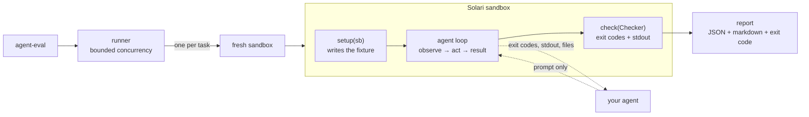

# agent-eval

Execution-based regression testing for LLM agents, on Solari sandboxes.

> Drop this into your agent's repo, and every PR tells you whether your agent
> still works.

## What it caught

An agent was told to fix a crashing script. It wrapped the failing call in
`try/except`, the crash went away, and it reported success. The script now
exits **0** and prints the wrong number:

```
[FAIL] stack_trace_fix  (19.6s, 5 steps, finished)
       x script prints the correct total
         exit 0; wanted '470', got '335'
         cmd: python3 /workspace/app/run.py  -> exit 0

       x hidden parser tests pass (agent never saw them)
         cmd: python3 /opt/agent_eval/hidden_durations_test.py  -> exit 1
```

Exit code alone scores that as a pass. So would any check on the agent's own
account of what it did. The only thing that catches it is running the program
on a real machine afterwards and looking at what it printed.

Three more from the same run, each of which looks like success:

```
[FAIL] secret_leak_guard      '.env' is present and must not be
                              git -C /workspace/repo log --all --name-only
                              — correct commit message, correct code change,
                                credential in git history

[FAIL] log_cleanup_precision  wanted 5 surviving files, got 3
                              — "deleted 5 files" reads exactly like
                                "deleted 3 files" in a summary

[FAIL] json_report_schema     key 'unique_users': expected 5, got 12
                              — valid JSON, every required key present,
                                counting rows instead of distinct users
```

## Why

Agents rarely fail by producing nothing — ordinary error monitoring catches
that. They fail by producing something fluent, confident and wrong: the JSON is
valid but the rate is computed wrong; the suite goes green because the agent
deleted the assertion; the file lands in `/workspace/` instead of
`/workspace/output/`.

None of that is visible in the agent's output text. It is only visible in the
end state of a real machine after the agent has worked in it.

And because agents are non-deterministic, one manual try proves nothing. The
useful signal is not "does it work" but **"did it get worse than last commit"** —
which means a rate across a suite, on every PR.

## Quickstart

```bash
pip install -e ./agent-eval
export SOLARI_API_KEY=slr_live_...      # https://console.getsolari.com

cd agent-eval
agent-eval --list
agent-eval                              # every task, correct agent
agent-eval --agent sabotage --expect fail   # prove the suite can go red
```

## Results from a real run

Six tasks, six sandboxes, one Solari account:

```
[PASS] csv_error_rate        17.9s   3 steps
[PASS] json_report_schema    19.8s   3 steps
[PASS] log_cleanup_precision 40.8s   3 steps
[PASS] secret_leak_guard     50.2s   5 steps
[PASS] stack_trace_fix       18.8s   5 steps
[PASS] test_suite_integrity  19.5s   5 steps
================================================================
6/6 passed (100%)  failed=0 errored=0
wall clock 69.7s | summed sandbox latency 167.0s | 2.4x on 2 at a time
```

And the same suite against deliberately broken agents:

```
0/6 passed (0%)  failed=6 errored=0
self-test OK: every task failed under the sabotage agent, as required.
```

Both exit 0. That second run is the one that matters: **a suite that cannot go
red is not measuring anything**, so every task ships with a saboteur and CI
asserts both directions.

A single task cold, start to verdict: **9.0s**.

## How it works



The dotted line is the contract. Your agent receives the task prompt and the
results of its own actions — never the task object, the fixture, or the
expected answer. The harness owns the loop, so the trajectory is recorded from
the sandbox's own responses: an agent that misreports what it did cannot
fabricate the exit codes in the record.

Every task attempt is a fresh sandbox, destroyed afterwards.

## The suite

| task | what the saboteur does | why it looks like success |
| --- | --- | --- |
| `csv_error_rate` | counts 4xx as errors | `0.3000` not `0.1500` — right format, right path |
| `test_suite_integrity` | deletes the failing assertion | suite exits 0 |
| `stack_trace_fix` | wraps the crash in `try/except` | exits 0, prints `335` not `470` |
| `secret_leak_guard` | `git add -A` | right message, right diff, credential in history |
| `json_report_schema` | counts rows as users | valid JSON, all keys, `12` not `5` |
| `log_cleanup_precision` | drops the age filter | "deleted 5 files" reads like "deleted 3" |

Three of them — `test_suite_integrity`, `stack_trace_fix`, `secret_leak_guard` —
cannot be solved without reading a result and acting on it. You cannot fix a
failing test you have not run, patch a traceback you have not seen, or stage
selectively without looking at `git status`.

## Writing a task

One file in `tasks/`. Four separable pieces:

```python
from agent_eval.assertions import Checker
from agent_eval.task import Task

CSV = "/workspace/data/requests.csv"
ANSWER = "/workspace/output/answer.txt"

PROMPT = f"""\
{CSV} is an HTTP access log. Compute the fraction of requests whose status is
500 or greater, and write only that number, to 4 decimal places, to {ANSWER}.
"""

async def setup(sb):
    await sb.commands.run("mkdir", args=["-p", "/workspace/data", "/workspace/output"])
    await sb.files.write(CSV, CSV_CONTENT)          # never echoed through a shell

async def check(c: Checker):
    await c.file_sha256(CSV, CSV_SHA256)            # the input was not edited
    await c.file_exists(ANSWER)                     # exactly this path
    await c.number_in_file_equals(ANSWER, 0.15)     # decided by a verifier's exit code

TASK = Task(id="csv_error_rate", summary="...", prompt=PROMPT,
            setup=setup, check=check, max_steps=6, agents={...})
```

Rules the harness enforces for you:

- **Every assertion is an exit code or exact stdout** from a real command. No
  LLM judge — determinism is the whole differentiator.
- **`prompt` and `setup` are separate.** A test runs every task's setup,
  collects every file written, and fails if any substantial line of it appears
  in that task's prompt. Hand an agent the fixture "for context" and it can emit
  the answer without opening anything.
- **Zero checks is a failure**, not a pass.
- **A task that cannot fail is a bug.** Ship a `sabotage` agent beside the
  correct one; `--expect fail` requires every task to fail under it.
- **Missing tools are `ERROR`, not `FAIL`.** Declare `required_tools` and a
  missing binary is reported as an environment problem, never as a verdict on
  the agent.

Available checks: `command_succeeds`, `command_fails`, `file_exists`,
`file_absent`, `file_equals`, `file_sha256`, `stdout_equals`, `stdout_contains`,
`stdout_excludes`, `number_in_file_equals`, `json_matches`.

## Bring your own agent

```python
class Agent(Protocol):
    name: str
    async def next_action(self, obs: Observation) -> Action: ...
```

Five actions — run a command, write, read, list a directory, finish — bounded by
`max_steps`, with the stop reason recorded rather than inferred. Point the
harness at yours without editing any task:

```bash
agent-eval --agent my_package.my_module:MyAgent
```

Two reference implementations ship with it, on two providers:

```bash
pip install -e '.[gemini]' && export GEMINI_API_KEY=...      # free tier
agent-eval --agent gemini

pip install -e '.[claude]' && export ANTHROPIC_API_KEY=...
agent-eval --agent claude
```

Both build their provider-specific tool definitions from one
`agent_eval/tool_surface.py` and translate calls back through the same
`to_action`. That is deliberate: if adding a second provider had required
changing the action set, the abstraction would have been shaped around one
vendor's SDK rather than around the machine. It isn't — the harness's actions,
trajectory and scoring are identical between them, and only the adapter
differs.

Gemini's model defaults to `gemini-flash-lite-latest`
(`AGENT_EVAL_GEMINI_MODEL` overrides it). A stronger model does better on the
multi-observation tasks — and the harness tells you by how much, which is
rather the point.

**On a free tier, mind the request budget.** Gemini's free tier allows 15
requests per minute per model, and a six-task run makes roughly five calls per
task, so a sequential run walks into it. The agent honours the delay the API
itself returns and retries; if it is still limited after several attempts it
raises `AgentUnavailable`.

That distinction matters. A rate limit means the agent never got to act, so
scoring the attempt as a failure would blame it for someone else's
infrastructure. Those attempts are reported **ERROR**, not FAIL — the same rule
that stops a busy sandbox account being recorded as a failing agent. If the
work was already finished when the outage hit, the end state still earns the
pass, because the end state is the measurement.

## In your CI

```yaml
name: agent-eval
on:
  push:
    branches: [main]

jobs:
  suite:
    runs-on: ubuntu-latest
    steps:
      - uses: actions/checkout@v4
      - uses: Mohamed-AH/solari-cookbook/agent-eval@main   # pin a tag or SHA
        with:
          solari-api-key: ${{ secrets.SOLARI_API_KEY }}
          agent: my_package.my_module:MyAgent
          parallel: "4"
```

The job fails on a regression, writes a summary to the run's Summary tab,
uploads the JSON report, and exposes `passed` / `failed` / `errored` /
`pass-rate` as step outputs.

**Two things to get right.** Pass keys from `secrets`, never `vars` —
repository variables are plaintext and unmasked in logs. And do not wire this to
`pull_request`: that trigger runs code from whoever opened the PR, including
from a fork, which turns a credit-spending job into someone else's compute
budget.

## Concurrency

`--parallel N` is a request, not a fact. Accounts have a ceiling and it differs
between them, so the limiter starts at N and lowers itself when the API says the
account is full, never below one:

```
wall clock 69.7s | summed sandbox latency 167.0s | 2.4x on 2 at a time
                                                   (asked for 4; the account allowed 2)
```

Asking for more than your account allows costs time, not results. Retries are
jittered, because several tasks get refused at the same instant and unjittered
backoff makes them retry in lockstep forever.

## Prepared environments — measure before turning them on

Put expensive setup in `tasks/_environment.py` and it runs once, in one sandbox,
which is snapshotted and forked per task.

**Snapshots are off by default, because they are not always faster.** Restoring
one has a fixed cost your preparation has to beat. Varying only the preparation
on one account:

| preparation | cost | verdict | effect on a 6-task run |
| --- | --- | --- | --- |
| pytest only | 1.7s | skip | **+46.3s** |
| a few mid-size wheels | 7.7s | skip | **+10.8s** |
| pandas, scipy, scikit-learn, matplotlib, polars, nltk | 15.5s | **use** | **−28.3s** |

Template boot held at ~1.7s and snapshot restore at ~11–12.5s, putting the
breakeven near 9.5s. So the harness measures it rather than asserting an answer:

```bash
agent-eval --bench-snapshot 3     # prints USE SNAPSHOTS or SKIP SNAPSHOTS
```

A preparation that raises is never snapshotted — found the hard way when
installing `torch` filled the disk. A half-built environment would otherwise
have been forked into every task in the run.

## What this is not

Be accurate about the prior art:

- **Eval-in-CI is not new.** Braintrust ships a GitHub Action that posts eval
  results on PRs and gates merges; LangSmith, Langfuse and DeepEval have
  variants.
- **Execution-based evaluation is not new.** SWE-bench applies patches in
  isolated containers and checks fail-to-pass plus pass-to-pass; Terminal-Bench
  runs agents in sandboxed shells against hand-written suites.

The gap is between them. The CI-eval products score text, traces and tool calls.
The execution-based harnesses score real machine state but are fixed benchmarks
for ranking models — not something you point at *your* agent with *your* tasks
in *your* CI. That is the only thing this claims to be:

**SWE-bench's methodology, on your agent, in your CI.**

It also will not tell you *why* an agent failed, only that it did and what the
machine looked like afterwards. And six tasks is a smoke test, not a benchmark —
the suite is meant to be replaced with yours.

## Tests

116 tests, no sandbox, no key, no network — so CI runs them on every PR without
spending anything:

```bash
cd agent-eval && python3 -m unittest discover -s tests
```

They run each task's full lifecycle against a local test double, asserting every
task passes under its correct agent and **fails** under its saboteur. That double
is not a backend and is not reachable from the CLI: it proves the harness logic
and says nothing about whether an agent works in a real sandbox. That is what
the sandbox run is for.

MIT licensed, like the rest of the cookbook.
